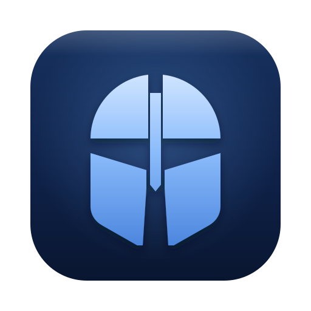

<p align="center">
  
</p>

# Heimdall

> Antes se llamaba **MediaForge**. El repositorio conserva el nombre `mediaforge`; la app, la ventana y la documentación se llaman Heimdall desde la v2.1.

Centro multimedia local para Windows, macOS y Linux: transcribe audio/vídeo a texto, convierte entre formatos populares y genera **documentos PDF enriquecidos** con capturas de pantalla sincronizadas a la transcripción. Todo con la mayor calidad y velocidad que tu hardware permita (incluyendo GPU NVIDIA / AMD / Intel cuando están disponibles).

> Sin nube, sin marcas de agua, sin límites artificiales. 100% local.

## 🚀 Quick Start (5 minutos)

Si solo quieres arrancar la app **ya** en Windows:

1. **Instala Python 3.10 o superior** desde https://www.python.org/downloads/.
   Durante la instalación marca estas dos casillas:
   - ✅ *Add Python to PATH*
   - ✅ *Install py launcher*
2. **Instala `ffmpeg`** abriendo *PowerShell* y ejecutando:
   ```powershell
   winget install Gyan.FFmpeg
   ```
   (Tras instalar, **cierra y reabre** la terminal para que reconozca el PATH.)
3. **Doble clic en `run.bat`** desde la carpeta del proyecto. La primera vez instalará las dependencias automáticamente; las siguientes solo abre la app.

Eso es todo. Si algo falla, abre un issue pegando la salida de la consola.

> 🍎🐧 **macOS / Linux**: `run.bat` es solo para Windows, pero la app funciona igual. Ve a [Instalación en macOS y Linux](#opción-c--macos-y-linux).

## La interfaz (v2.0)

Una ventana con barra lateral y dos herramientas: **Transcribir reunión** y **Convertir vídeo**.

- Cada herramienta pide lo mínimo: el archivo y el resultado que quieres. Lo técnico (modelo, dispositivo, modo de capturas, deduplicación, códec, aceleración) está en **Mostrar opciones avanzadas**, con valores por defecto que funcionan.
- Una barra fija abajo muestra siempre el estado, el tiempo transcurrido, el progreso y el botón principal. Al terminar aparecen **Abrir PDF/texto** y **Mostrar carpeta**.
- **Ver registro** abre el detalle técnico de ffmpeg y Whisper, con botón para copiarlo si algo falla.
- Apariencia **Sistema / Claro / Oscuro** desde la barra lateral. Un solo color de acento (azul claro) marca la acción principal, el progreso y los enlaces; todos los textos cumplen contraste ≥ 4,5:1 en ambos modos.

## Módulos

### 🎙️ Transcribir reunión → Solo texto
- Extrae el audio con **ffmpeg** y lo transcribe con **faster-whisper**.
- Modelos: `tiny`, `base`, `small`, `medium`, `large-v3`.
- Idiomas: español, inglés, francés, alemán, italiano, portugués + auto-detección.
- Salida: `.txt` junto al archivo de entrada (se puede cambiar en "Guardar en").

### 🔄 Convertir vídeo
- Convierte entre formatos populares: **MP4** (H.264 / H.265) o extrae audio a **MP3**.
- Aceleración por hardware cuando esté disponible:
  - **NVIDIA NVENC** (`h264_nvenc` / `hevc_nvenc`)
  - **AMD AMF** (`h264_amf` / `hevc_amf`)
  - **Intel Quick Sync** (`h264_qsv` / `hevc_qsv`)
  - **CPU** (`libx264` / `libx265`) como fallback
- Calidades: Alta, Media, Baja.
- Barra de progreso en tiempo real basada en `ffmpeg -progress`.

### 📑 Transcribir reunión → Documento con capturas
- Toma un **vídeo** (mp4, mkv, avi, mov…) y produce un **PDF navegable** donde cada página es un bloque:
  ```
  ┌──────────────────────────────────────────┐
  │ [00:01:23]   bloque 5/32                 │
  │ ┌──────────────────────────────────────┐ │
  │ │                                      │ │
  │ │   [captura del frame a 1m 23s]       │ │
  │ │                                      │ │
  │ └──────────────────────────────────────┘ │
  │ Transcripción (3 segmentos):             │
  │  Hola que tal, en esta diapositiva       │
  │  podemos ver que el objetivo Q3 es…      │
  └──────────────────────────────────────────┘
  ```
- **Modos de extracción de frames** (configurable):
  - **Híbrido** (recomendado): cambio de escena + 1 frame cada N segundos.
  - **Solo cambios de escena** (umbral 0.1–0.6).
  - **Solo intervalo fijo** (cada 5–60 s).
- **Tamaños configurables**:
  - Sensibilidad de escena: **0.01 (muy sensible) – 0.40 (poco sensible)**.
  - Ventana de correlación: ±5–60 s (cuánto texto se adjunta por frame).
- **Deduplicación perceptual (nuevo en v1.3)**: tras la extracción, un paso de pHash + clustering temporal descarta frames visualmente redundantes (movimientos de cursor, scroll, animaciones). Por defecto **activado**, configurable desde el panel **⚙️ Opciones avanzadas**:
  - Umbral perceptual: **0 (agresivo) – 10 (permisivo)**.
  - Ventana de agrupación: **5 – 60 s** (cooldown mínimo entre frames).
  - Reducción típica: ~70 % menos frames sin perder momentos visualmente distintos.
- **Calidad de imagen**: tres presets que re-codifican cada frame como JPEG progresivo. Reduce drásticamente el tamaño del PDF y de la carpeta de frames sin pérdida visible:
  - **Alta** (q92): ~200 KB/frame — fidelidad máxima.
  - **Media** (q85, recomendada): ~120 KB/frame — idéntico al original a simple vista.
  - **Baja** (q75): ~60 KB/frame — ahorra más espacio, leve pérdida de nitidez.
  - Comparativa típica (39 frames de pantalla compartida): PNG lossless → 88 MB; JPEG q85 → **3 MB** (~30× menos).
- **Salidas opcionales**: PDF, JSON estructurado, `.txt` con timestamps, carpeta de frames.
- **Auto-fallback**: si tu vídeo no tiene cambios de escena con score ≥ al threshold que pusiste, la app reintenta automáticamente con el mínimo (0.01) en modo escena, o con intervalo fijo en modo híbrido, y avisa en el log. Si el que falla es ffmpeg (archivo dañado, formato no soportado), el log muestra el error real de ffmpeg.
- Usa `fpdf2` para el PDF (puro Python) y `Pillow` para mantener las imágenes ligeras.
- **PDF Unicode opcional**: por defecto usa Helvetica built-in (Latin-1, soporta acentos del español). Si colocas `assets/DejaVuSans.ttf` + `assets/DejaVuSans-Bold.ttf` en la carpeta del proyecto, el PDF pasa automáticamente a Unicode completo (japonés, chino, coreano, árabe, cirílico, etc.). Sin esos archivos, los caracteres fuera de Latin-1 se reemplazan por `?` — la app **nunca** falla.
- **Limpieza de alucinaciones de Whisper**: si el audio tiene silencios largos, Whisper puede inventarse caracteres chinos / japoneses / coreanos. Esos caracteres se eliminan automáticamente del PDF antes de imprimirlo (los `.txt` y `.json` los conservan para que veas lo que Whisper dijo realmente).

## 📋 Requisitos

Necesitas **tres cosas** instaladas en tu sistema antes de poder ejecutar Heimdall:

### 1. Sistema operativo
- **Windows 10 u 11**: plataforma principal, con `run.bat` para instalar y arrancar.
- **macOS y Linux**: los módulos de transcripción, conversión y enriquecido funcionan igual (verificado en macOS con ffmpeg 9). `run.bat` no aplica; se instala a mano (ver [Opción C](#opción-c--macos-y-linux)). La interfaz necesita Tkinter (`brew install python-tk` / `sudo apt install python3-tk`).
- **Aceleración**: la transcripción por GPU es solo NVIDIA CUDA (Windows/Linux). En Mac transcribe por CPU. En el conversor, VideoToolbox de Apple no está soportado todavía: usa CPU.

### 2. Python 3.10 o superior
Descárgalo de https://www.python.org/downloads/. Durante la instalación **marca estas dos casillas**:
- ✅ *Add Python to PATH*
- ✅ *Install py launcher*

Para verificar que quedó bien instalado, abre PowerShell y ejecuta:
```powershell
py -3 --version
```
Debería mostrar `Python 3.10.x` o superior.

### 3. ffmpeg 5.1 o superior en el PATH
Lo usan **Transcriptor** y **Conversor**. Se requiere 5.1+ porque la extracción de frames usa `-fps_mode` (la opción antigua `-vsync` se eliminó en ffmpeg 7). La forma más rápida en Windows es:
```powershell
winget install Gyan.FFmpeg
```
Tras instalar, **cierra y reabre** cualquier terminal abierta para que reconozca el nuevo PATH.

Verifica con:
```powershell
ffmpeg -version
```

Alternativas si `winget` no te funciona:
- Descarga un build estático desde https://www.gyan.dev/ffmpeg/builds/ y descomprime, luego añade la carpeta `bin\` resultante a tu PATH manualmente.
- `choco install ffmpeg` (si tienes Chocolatey).
- `scoop install ffmpeg` (si tienes Scoop).

## 🛠️ Instalación

### Opción A — Automática (recomendada)
Simplemente doble clic en **`run.bat`**. Este script:
1. Verifica que Python y ffmpeg estén instalados.
2. Si faltan dependencias, las instala desde `requirements.txt` (`faster-whisper`, `customtkinter`, `fpdf2`, `Pillow`, `imagehash`).
3. Si detecta una GPU NVIDIA y los wheels CUDA no están, **pregunta** si quieres descargarlos (≈1.4 GB). Si respondes `N`, la app arranca igual y transcribe por CPU.
4. Lanza `main.py`.

La consola **se queda abierta** al final para que veas cualquier error. No la cierres hasta que termines de usar la app.

### Opción B — Instalación manual
Si prefieres control fino, sin `run.bat`:

```powershell
# 1) Abre PowerShell en la carpeta del proyecto
cd C:\Apps\pruebas\mediaforge

# 2) (Recomendado) crea un entorno virtual para no contaminar el Python global
py -3 -m venv .venv
.\.venv\Scripts\Activate.ps1

# 3) Instala las dependencias
py -3 -m pip install -r requirements.txt

# 4) (Opcional) Si tienes GPU NVIDIA y quieres transcripción por GPU:
py -3 -m pip install nvidia-cublas-cu12 nvidia-cudnn-cu12 nvidia-cuda-runtime-cu12

# 5) Ejecuta la app
py -3 main.py
```

### Opción C — macOS y Linux

```bash
# macOS
brew install ffmpeg python-tk
# Linux (Debian/Ubuntu)
sudo apt install ffmpeg python3-tk python3-venv

cd mediaforge
python3 -m venv .venv
.venv/bin/pip install -r requirements.txt
.venv/bin/python main.py
```

Los botones "Abrir PDF" y "Abrir carpeta" usan `open` en macOS y `xdg-open` en Linux.

#### macOS: crear `Heimdall.app` (recomendado)

Si abres la app con `python main.py`, macOS la ejecuta dentro de `Python.app`: el menú dice "Python" y al abrir y al cerrar el Dock muestra el cohete de Python. Para que siempre aparezcan el nombre y el ícono de Heimdall, crea la app una vez:

```bash
sh tools/build_macos_app.sh --install
```

Queda en `~/Applications/Heimdall.app` y se abre desde Launchpad, Spotlight o el Dock (puedes fijarla con "Mantener en el Dock"). La app no copia el código: ejecuta `main.py` y el `.venv` de esta carpeta, así que un `git pull` la actualiza. Si mueves la carpeta o recreas el `.venv` con otra versión de Python, vuelve a correr el script.

> 💡 **Entorno virtual (`.venv`)**: está ignorado por `.gitignore`, así que puedes crearlo sin miedo. Si no quieres usarlo, sáltate los pasos 2 y simplemente usa tu Python global.

### Soporte GPU opcional (NVIDIA)

Por defecto Heimdall usa la **CPU** (funciona siempre). Si tienes una GPU NVIDIA reciente (RTX 20xx/30xx/40xx) puedes acelerar la transcripción **5–10×** instalando los wheels de CUDA:
```powershell
py -3 -m pip install nvidia-cublas-cu12 nvidia-cudnn-cu12 nvidia-cuda-runtime-cu12
```
Solo necesitas un **driver NVIDIA actualizado** (≥ 525). No hace falta instalar el CUDA Toolkit completo (~3 GB), esos wheels ya traen las DLLs.

En la app, abre **Transcribir reunión → Mostrar opciones avanzadas** y elige `Dispositivo: Automático` (recomendado) o `GPU NVIDIA (CUDA)`.

### Soporte Unicode opcional (PDF con japonés, chino, árabe…)

Por defecto el PDF usa *Helvetica* built-in (Latin-1): cubre acentos del español, pero caracteres fuera de Latin-1 salen como `?`. Si quieres soporte Unicode completo:

1. Descarga `DejaVuSans.ttf` y `DejaVuSans-Bold.ttf` desde https://github.com/dejavu-fonts/dejavu-fonts/tree/master/ttf
2. Colócalas en `mediaforge\assets\`
3. La app las detectará automáticamente en el siguiente arranque.

(La carpeta `assets/` está en `.gitignore`, así que no contaminas el repo.)

## ▶️ Ejecución rápida

Una vez instalado, **cada vez** que quieras usar la app:

- **Windows con run.bat**: doble clic en `run.bat`.
- **Windows sin run.bat**:
  ```powershell
  cd C:\Apps\pruebas\mediaforge
  py -3 main.py
  ```
- **macOS / Linux**: `.venv/bin/python main.py` desde la carpeta del proyecto.

La app abre una ventana con dos herramientas en la barra lateral: **Transcribir reunión** y **Convertir vídeo**.

## Estructura

```
mediaforge\
├── main.py            # Ventana, barra lateral y las dos páginas (transcribir, convertir)
├── ui_kit.py          # Paleta claro/oscuro, controles y la página base con barra de acción
├── transcriber.py     # Módulo 1: ffmpeg + faster-whisper
├── converter.py       # Módulo 2: conversión de vídeo/audio
├── analyzer.py        # Módulo 3: correlación multimodal + PDF enriquecido
├── report.py          # Mini-informes al final de cada operación
├── branding/          # Ícono de Heimdall: heimdall.svg (fuente) + .png, .ico, .icns
├── tools/
│   ├── build_icons.sh       # Regenera los íconos desde el SVG
│   └── build_macos_app.sh   # Crea Heimdall.app (macOS) con nombre e ícono propios
├── requirements.txt   # Dependencias Python
├── run.bat            # Arranque en Windows (instala deps + lanza main.py)
├── .gitignore         # Exclusiones para git
└── README.md          # Este archivo
```

## Solución de problemas

| Error | Causa | Solución |
|---|---|---|
| `Library cublas64_12.dll is not found or cannot be loaded` | ctranslate2 intentó usar GPU NVIDIA sin las DLLs de CUDA disponibles. | **Solución recomendada (1.4 GB)**: `py -3 -m pip install nvidia-cublas-cu12 nvidia-cudnn-cu12 nvidia-cuda-runtime-cu12` y reinicia la app. La próxima versión de `run.bat` lo hace automáticamente. **Alternativa (3 GB)**: instalar CUDA Toolkit 12.x desde https://developer.nvidia.com/cuda-downloads. Mientras tanto, cambia "Dispositivo" a "CPU (software)" en la app. |
| `ffmpeg no está en PATH` | ffmpeg no instalado. | `winget install Gyan.FFmpeg` y reinicia la terminal. |
| `Model download failed` al transcribir | Red/firewall bloquea huggingface.co. | Reintenta; o descarga manualmente desde https://huggingface.co/Systran/faster-whisper-small. |
| Conversión se queda al 0% y da error | El codec que elegiste no funciona con tu hardware. | En opciones avanzadas cambia "Aceleración" a `Automática` o `Procesador (CPU)`. |
| Ventana se cierra al doble clic en `run.bat` | El `.bat` no mostraba errores. | `run.bat` siempre hace `pause` al final. |
| Enriquecida: muchos frames (>300) | Threshold muy bajo o intervalo muy corto. | Sube "Sensibilidad de escena" o "Intervalo entre frames". |
| Enriquecida (modos escena/híbrido): `Unrecognized option 'vsync'` o 0 frames con cualquier vídeo | Versiones ≤ 1.5 usaban `-vsync`, eliminado en ffmpeg 7+. | Corregido en v1.5.1 (usa `-fps_mode`). Requiere ffmpeg 5.1+. |
| Transcripción: `TypeError: open() got an unexpected keyword argument 'metadata_errors'` | PyAV 19 quitó un argumento que usa faster-whisper. | Corregido en v1.5.1: `requirements.txt` fija `av<19`. Si ya lo tienes: `pip install "av<19"`. |
| Enriquecida con fuentes DejaVu: `Undefined font: dejavuI` | Faltaba registrar la variante cursiva. | Corregido en v1.5.1. |
| Enriquecida: 0 frames, "ffmpeg no produjo ningún frame" | El vídeo no tiene cambios de escena con score ≥ threshold. | v1.1 hace auto-fallback a threshold 0.01. Si sigue sin haber frames, cambia el modo a "Intervalo fijo". |
| Enriquecida: intervalo produce demasiados frames | (Bug de v1.0) `lt(mod(t,N),1)` seleccionaba 24 frames por intervalo. | v1.1 usa `fps=1/N` y produce exactamente 1 frame cada N segundos. |
| Ventana corta no muestra todo el contenido | La pestaña no tenía scroll. | v1.1 envuelve cada pestaña en un `CTkScrollableFrame`; si la ventana es más baja que el contenido aparece una scrollbar automáticamente. |
| PDF no muestra acentos | Estás usando fpdf2 con una fuente no Unicode. | v1.2 usa Helvetica built-in (Latin-1), que cubre todos los acentos del español. Para Unicode completo (japonés, chino, etc.) coloca las fuentes en `assets/`. |
| Enriquecida: `FPDFUnicodeEncodingException: Character "X" outside the range of helvetica` | El audio tiene caracteres fuera de Latin-1 (japonés, chino, coreano, árabe, cirílico…) y no tienes fuentes Unicode. | v1.2 detecta esto automáticamente: usa Helvetica + filtra los caracteres problemáticos (salen como `?`). La app **no falla**, solo pierdes esos caracteres. Para soporte Unicode completo, descarga `assets/DejaVuSans.ttf` y `assets/DejaVuSans-Bold.ttf` desde https://github.com/dejavu-fonts/dejavu-fonts/tree/master/ttf. |

## Limitaciones conocidas

- **Transcripción**: sin diarización (no etiqueta "Hablante 1 / Hablante 2").
- **Transcripción**: sin marcas de tiempo en el `.txt` plano (la pestaña "Transcripción enriquecida" sí las incluye).
- **Conversor**: el audio se re-codifica a AAC. Para passthrough (mantener audio original), edita `converter.py` y reemplaza `-c:a aac -b:a 192k` por `-c:a copy`.
- **Enriquecida**: sin OCR (no lee el texto que aparece en pantalla; solo guarda la imagen). Ver roadmap v2.

## 📝 Historial de cambios

### v2.1 — Ahora se llama Heimdall
- **Nombre nuevo**: la app pasa de MediaForge a **Heimdall** (ventana, barra lateral, PDF generado, `run.bat` y documentación). El repositorio sigue siendo `mediaforge`.
- **Ícono propio**: casco con cresta, guarda nasal y carrilleras sobre un fondo azul noche, en el azul claro de la app. Aparece en la ventana, el Dock/barra de tareas y junto al nombre en la barra lateral.
- **`Heimdall.app` para macOS** (`sh tools/build_macos_app.sh --install`): con `python main.py` el Dock mostraba el cohete de Python al abrir y al cerrar, y el menú decía "Python"; desde la app siempre se ven el nombre y el ícono de Heimdall.
- **Íconos versionados** en `branding/`: `heimdall.svg` es la fuente; `heimdall.png` (ventana y Dock), `heimdall.ico` (Windows, 16–256 px) y `heimdall.icns` (macOS) se regeneran con `sh tools/build_icons.sh`.

### v2.0 — Interfaz nueva
- **Barra lateral con dos herramientas** en vez de 4 pestañas: "Transcribir reunión" une el transcriptor y la transcripción enriquecida (eliges "Documento con capturas" o "Solo texto"); "Convertir vídeo" es el conversor.
- **Opciones avanzadas plegadas**: el uso normal es elegir archivo y pulsar un botón. Las etiquetas hablan en términos del resultado ("Preciso, más lento") y no del parámetro.
- **Barra de acción fija** con estado, cronómetro, progreso, cancelar y, al terminar, abrir el resultado o su carpeta.
- **Modo claro y oscuro** con el selector en la barra lateral. Acento azul claro único; selección neutra (como macOS) para que el texto seleccionado se lea en los dos modos; cancelar es neutro porque no destruye nada.
- Se eliminó `home.py` (la pestaña de inicio con tarjetas).

### v1.5.1 — Correcciones
- **Frames con ffmpeg 7+**: los modos "Solo cambios de escena" e "Híbrido" fallaban siempre porque `-vsync` ya no existe; ahora se usa `-fps_mode`.
- **Errores honestos**: si ffmpeg falla, el log muestra su error real en vez de decir que el vídeo no tiene cambios de escena. El modo híbrido sin frames reintenta con intervalo fijo.
- **Transcripción**: `requirements.txt` fija `av<19`; PyAV 19 rompía toda transcripción con faster-whisper.
- **PDF**: ya no genera una página extra con solo el número por cada bloque; con fuentes DejaVu ya no falla por la cursiva; no recomprime los JPEG (antes había doble compresión).
- **Frames**: al repetir un análisis ya no quedan frames de la corrida anterior; desmarcar "conservar frames" ahora sí borra la carpeta; avisos cuando un frame no se puede comprimir o faltan timestamps.
- **Conversor**: barra de progreso y cancelación inmediata también al extraer MP3; si se cancela o falla, se borra el archivo a medias y el error incluye las últimas líneas de ffmpeg.
- **macOS / Linux**: los botones "Abrir" ya no fallan (antes usaban `os.startfile`, solo Windows).
- **run.bat**: corregido `2>n1` (creaba un archivo basura `n1`), escapados los paréntesis en los mensajes, verifica todas las dependencias y pregunta antes de descargar 1,4 GB de CUDA.

### v1.5 — Mini-informe al final de cada operación
- **Qué**: al terminar una transcripción, conversión o enriquecido, la app emite un pequeño recuadro en el log con tiempos por fase, tamaños, conteos y velocidad.
- **Por qué**: para tener visibilidad inmediata de cuánto tarda cada parte (audio, modelo, frames, dedup, PDF…) y comparar entre configuraciones sin tener que mirar timestamps.
- **Aspecto** (transcripción):
  ```
  ┌────────────────────────────────────────────────────────────┐
  │ TRANSCRIPCIÓN  ·  21s total                                │
  ├────────────────────────────────────────────────────────────┤
  │   Vídeo:              Metodologia Scrumm - Equipo          │
  │                       Solucionador.mp4 (20.0 MB · 2m 04s)  │
  │   Modelo:             medium · es · cuda                   │
  │   Salida:             prueba_scrumm_report.txt (2.0 KB)    │
  │                                                            │
  │   Extracción audio:   0.2s                                 │
  │   Carga modelo:       9.2s                                 │
  │   Transcripción:      11s                                  │
  │                                                            │
  │   Segmentos:          29                                   │
  │   Audio transcrito:   2m 04s                               │
  │   Velocidad:          11.2× realtime                       │
  └────────────────────────────────────────────────────────────┘
  ```
- **Conversión**: muestra encoder detectado (NVIDIA NVENC, AMD AMF, Intel QSV, CPU), resolución, delta de tamaño (`-69%` o `+29%`) y velocidad.
- **Enriquecido**: desglosa las 5 fases (audio, transcripción, frames, dedup, correlación) y los 3 outputs (PDF, JSON, TXT) con su tamaño final.
- **Texto plano**: no es un popup, va al mismo log. Sigue funcionando con el botón "📋 Copiar log" para pegarlo en un chat.

### v1.4.1 — Fix raíz: `cublas64_12.dll is not found`
- **Causa raíz**: el driver NVIDIA estaba instalado pero faltaban las DLLs de CUDA en el sistema. ctranslate2 las carga dinámicamente desde PATH al instanciar un modelo.
- **Solución**: `_register_nvidia_wheels()` en `transcriber.py` localiza automáticamente los wheels `nvidia-cublas-cu12` / `nvidia-cudnn-cu12` / `nvidia-cuda-runtime-cu12` (que sí incluyen las DLLs) y los añade a PATH **antes** de cualquier import de ctranslate2. Funciona también desde `analyzer.py` y desde el modo `device="auto"`.
- **Instalación automática**: `run.bat` ahora detecta si hay GPU NVIDIA y, si los wheels CUDA no están, los instala automáticamente. Solo ~1.4 GB (vs ~3 GB del CUDA Toolkit completo).
- **Bug API**: `ctranslate2.get_device_count("cuda")` no existe; renombrado a `get_cuda_device_count()`. Corregido en `detect_compute()` con fallback a la API antigua.
- **Mensaje de error accionable**: si aun así falla la carga en CUDA, el error ahora dice exactamente qué wheels instalar en lugar de la cita críptica de cuBLAS.
- **Verificado en local con un RTX 4060**: vídeo MP4 de 124.8s transcrito en 16.5s con `medium` en GPU (vs ~45s en CPU).

### v1.4 — Soporte opcional para GPU (NVIDIA CUDA)
- **Selector "Dispositivo"** en el Transcriptor y la pestaña "Enriquecida": `Auto` (recomendado, intenta CUDA y si falla usa CPU), `CPU (software)` o `GPU (NVIDIA CUDA)`.
- **Detección automática al inicio**: la app consulta `ctranslate2` para saber si hay GPUs NVIDIA visibles y muestra el resultado en la barra inferior (`GPU transcripción: NVIDIA CUDA (1 disp.)` o `GPU transcripción: no detectada`).
- **Fallback silencioso**: si eliges `Auto` y CUDA falla (típico cuando falta CUDA Toolkit), la app cae a CPU automáticamente con un mensaje claro en el log — nunca crashea.
- **Mensaje claro si fallas GPU explícita**: si eliges `GPU (NVIDIA CUDA)` y no tienes CUDA Toolkit 12.x instalado, obtienes un error accionable (`¿Tienes instalado NVIDIA CUDA Toolkit 12.x?`) en vez del críptico `cublas64_12.dll not found`.
- **Velocidad**: ~5–10× más rápido que CPU en GPU dedicadas (RTX 3060+). Para 1 hora de audio con modelo `small`: CPU ~10 min vs GPU ~1–2 min.
- **Solo NVIDIA**: AMD (ROCm) e Intel (oneAPI/QuickSync) no soportados por `faster-whisper`.

### v1.3 — Deduplicación perceptual + limpieza de alucinaciones Whisper
- **Deduplicación perceptual con pHash**: nuevo paso entre la extracción de frames y la correlación con la transcripción. Compara cada frame con el último guardado y descarta los perceptualmente similares. Reduce drásticamente el número de páginas del PDF en reuniones con pantallas estáticas y movimiento de cursor (caso típico: 300+ frames → 30-50). Configurable desde el panel **⚙️ Opciones avanzadas** de la pestaña "Enriquecida" (umbral 0-10, ventana de agrupación 5-60 s).
- **Limpieza de caracteres CJK en el PDF**: Whisper a veces "alucina" caracteres chinos/japoneses/coreanos en silencios o música. Esos caracteres se eliminan automáticamente del PDF (no de los `.txt` ni `.json`, que conservan la transcripción cruda para que puedas ver qué dijo realmente Whisper si te interesa).
- **Log de progreso enriquecido**: ahora se ve `[3b/5]` con el conteo antes/después de la deduplicación (`312 → 47 frames (-85%)`).

### v1.2 — Pulido de "Enriquecida" + robustez Unicode
- **Calidad de imagen configurable**: cada frame extraído se re-codifica como JPEG progresivo antes de incluirlo en el PDF. Tres presets (Alta q92 / Media q85 / Baja q75) → reduce el peso ~30× sin pérdida visible. Ejemplo real: 39 frames de pantalla compartida pasaron de 88 MB (PNG lossless) a 3 MB (JPEG q85).
- **PDF Unicode opcional**: si colocas `assets/DejaVuSans.ttf` + `assets/DejaVuSans-Bold.ttf` en la carpeta del proyecto, el PDF se genera con Unicode completo (japonés, chino, coreano, árabe, cirílico, etc.). Sin esos archivos, la app **nunca falla**: usa Helvetica built-in y reemplaza cualquier carácter fuera de Latin-1 por `?` (acentos del español se preservan siempre).
- **Log grande con botón "📋 Copiar log"** integrado en la pestaña, para pegar el detalle de cualquier error en un chat.
- **Traceback completo** en caso de excepción: cualquier error de `analyzer.py` se captura con su pila completa y se muestra en el log.
- **Captura de pantalla de error** en `Errores conocidos`: cuando algo falla, el botón "Copiar log" pone el traceback en el portapapeles.

### v1.1 — Robustez de la pestaña "Enriquecida"
- **Auto-fallback de threshold**: si tu vídeo no tiene cambios de escena con score ≥ al que pusiste, la app reintenta sola con el mínimo (0.01). Ya no se queda en "0 frames".
- **Slider de sensibilidad extendido**: rango 0.01 (muy sensible) – 0.40 (poco sensible). Antes era 0.10–0.60 y se saltaba los vídeos con cambios sutiles.
- **Fix de "intervalo produce demasiados frames"**: el filtro ffmpeg antiguo seleccionaba 24 frames por cada intervalo. Ahora se usa `fps=1/N` y produce exactamente 1 frame cada N segundos.
- **Scroll en todas las pestañas**: cada pestaña va envuelta en un `CTkScrollableFrame`. Si reduces la altura de la ventana, aparece una scrollbar automática y se llega a todos los controles.

## 🛣️ Roadmap (futuras versiones)

### v2 — OCR con Tesseract
- **Qué añade**: lee el texto que aparece en pantalla en cada frame y lo añade al PDF, debajo de la imagen.
- **Por qué importa**: en una reunión donde alguien comparte una slide o un dashboard, el OCR captura "OKR Q3 — Retención 78% → 85%" y lo indexa. Combinado con la transcripción de audio, el PDF se vuelve buscable: encontrar el momento exacto en que se habló de "retención" es trivial.
- **Cómo se haría**:
  - `pip install pytesseract`
  - Instalar Tesseract OCR desde https://github.com/UB-Mannheim/tesseract/wiki (binario Windows)
  - En `analyzer.py`, después de extraer un frame, ejecutar `pytesseract.image_to_string(frame, lang="spa+eng")`
  - Añadir el texto OCR como segundo bloque bajo la imagen en el PDF
- **Coste**: +5–10 min de proceso por hora de vídeo (depende de CPU).

### v3 — Inteligencia sobre el documento
Tres sub-ideas, todas opcionales y configurables. El usuario activa solo las que quiera.

#### v3a — LLM local (resumen + preguntas)
- **Qué añade**: un resumen ejecutivo automático de la reunión ("los puntos clave fueron…"), tabla de temas con saltos a cada momento del PDF, y un modo "pregúntale al vídeo" donde escribes una pregunta y el sistema busca en la transcripción + OCR los momentos relevantes.
- **Por qué importa**: convierte un PDF de 50 páginas en algo consultable.
- **Herramientas**:
  - **Ollama** (https://ollama.com) + modelo como `llama3.1:8b` o `mistral` → instalación trivial, todo local, sin enviar datos a la nube.
  - Alternativa Python: `llama-cpp-python` para incrustar el modelo en la propia app.
- **Configuración**: el usuario indica la ruta del binario de Ollama o del modelo GGUF. Variable de entorno `OLLAMA_HOST` opcional.
- **Privacidad**: 100% local. La reunión nunca sale del PC.

#### v3b — Diarización (quién habla)
- **Qué añade**: cada línea de la transcripción se etiqueta con "Hablante 1", "Hablante 2", etc. Útil cuando hay 2+ personas y quieres saber quién dijo qué.
- **Por qué importa**: en una reunión de 2 personas, leer la transcripción sin saber quién dijo qué es un lío.
- **Herramientas**:
  - `pyannote.audio` (https://github.com/pyannote/pyannote-audio)
  - Requiere un token gratuito de HuggingFace (el usuario lo mete en `~/.huggingface/token` o en una variable de entorno).
- **Coste**: +2x tiempo de procesamiento (corre el audio por dos modelos).

#### v3c — Integración opcional con APIs externas
- **Qué añade**: si el usuario lo configura, se puede enviar el `.txt` final a un LLM externo (Claude, OpenAI, Gemini) para un resumen de mayor calidad.
- **Por qué importa**: los modelos locales de 8B no son tan buenos como GPT-4/Claude. Para resúmenes profesionales, una API puede merecer la pena.
- **Cómo se haría**:
  - Variable de entorno `HEIMDALL_API_KEY` (Claude / OpenAI)
  - Campo opcional en la pestaña "Enriquecida" con el modelo a usar
  - La app **deja claro en la UI** que el contenido se envía a un servicio externo, y solo lo hace si el usuario lo activa explícitamente
- **Privacidad**: ⚠️ los datos salen del PC. Documentar bien este punto en la UI.

## Cronograma tentativo

- **v2 (OCR)**: siguiente iteración, ~1 sesión de trabajo.
- **v3a (LLM local)**: cuando el usuario lo pida, ~2 sesiones.
- **v3b (diarización)**: opcional, ~1 sesión.
- **v3c (API)**: opcional, ~media sesión.

Si te interesa alguna de estas, dímelo y la priorizamos. La v1 actual ya es útil por sí sola: cualquier reunión de Teams que grabes la puedes convertir en un PDF consultable en 5–10 minutos.